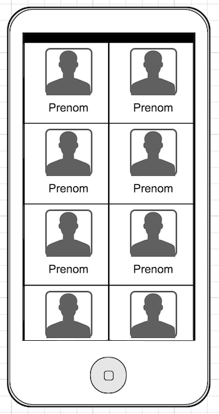

# Android intern : user list

* Android Java (Android studio)

## Objective

The purpose of this project is to build a "contact" grid view.

You have to build an Android application presenting this simple grid view. You don't need to take a special care about the UI but good taste will be well appreciate.

For the image and name you can build a dynamic collection on your own with at least 20 records.
