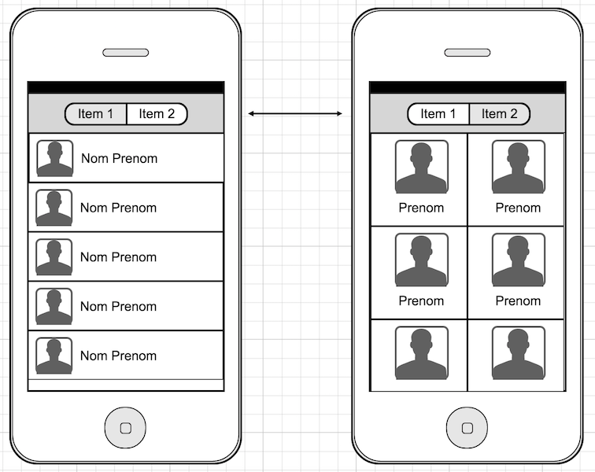

# iOs Intern : friend list

* Objective-C or Swift, your choice
* add [aureliensibiril](https://github.com/aureliensibiril) to your repo

## Objective

The purpose of this project is to build a "contact list" view.

You have to build an iOs application presenting this simple list view. You don't need to take a special care about the UI but good taste will be well appreciate.

For the image and name you can build a static collection on your own with at least 20 records.

### Requirement : make it smooth !

## Bonus 1 :

Add a second view allowing the user to switch between representation with a nice transition.

## Bonus 2 :

Source the user list from https://randomuser.me/ and build an infinite scroll.
